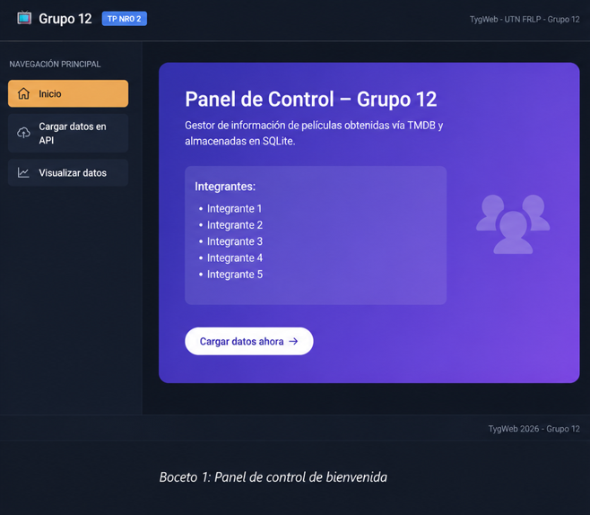
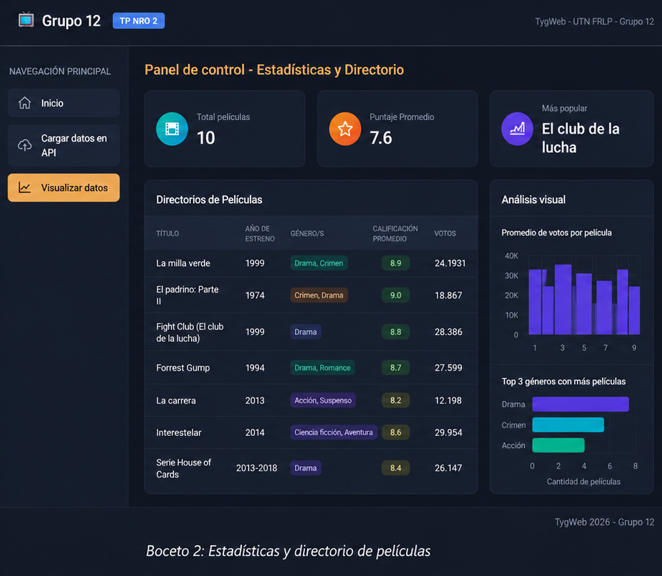

# Trabajo Práctico 2 - Grupo 12

**Tecnología y Gestión Web - UTN FRLP - 2026**

### Integrantes
*   Leandro Sesin (20766)
*   Cristian Hrynkiewicz (33112)
*   Baltazar Martinez (33242)
*   Rey Lautaro (34321)

---

### Desarrollo de la aplicación

El objetivo del trabajo es armar una aplicación web para traer las 10 películas más populares de 1999. Vamos a guardar el título, la sinopsis, los géneros y los votos en Strapi, para después poder ver toda esa información acomodada en nuestra propia página.

---

### Investigación del sitio

The Movie Database (TMDB) actúa como un Backend-as-a-Service (BaaS) centralizado de metadatos multimedia, proveyendo una API RESTful que abstrae la complejidad de diseñar y mantener bases de datos desde cero. Su función principal es ofrecer múltiples endpoints para que las aplicaciones cliente puedan realizar data fetching asíncrono mediante peticiones HTTP. De esta forma, cuando el frontend requiere información para sus vistas, despacha solicitudes (por ejemplo, GET) y recibe una respuesta estructurada en formato JSON. Esto permite parsear los datos, actualizar el estado de la aplicación y renderizar el DOM de forma dinámica, manteniendo la capa de persistencia de datos totalmente desacoplada de la interfaz (UI).

Sin embargo, al tratarse de una API privada que gestiona un alto volumen global de peticiones, su consumo exige un protocolo de autorización estricto. Para poder interactuar con los endpoints, el cliente debe incluir un token validando la identidad y los permisos de la solicitud. Sin este token, el servidor rechazará la conexión.

---

### Creación de cuenta y autenticación en el sitio TMDB

Para obtener y utilizar la clave de la API de The Movie Database, primero se debe crear una cuenta de usuario en su plataforma y registrar la aplicación desde el panel de configuración para que el sistema genere automáticamente las credenciales de desarrollador. Una vez que se posee el token de autenticación (API Read Access Token), su implementación es directa: se debe incluir dentro de los headers bajo el parámetro `Authorization: Bearer <TOKEN>` y `accept: application/json` en cada petición HTTP. De esta manera, el servidor autorizará la descarga del payload en formato JSON.

---

### Relevamiento de las APIs

Se presentan las APIs consumidas para la resolución del problema:

*   **Discover Movies (TMDB)**
    *   **Método:** GET
    *   **API:** `https://api.themoviedb.org/3/discover/movie`
    *   **Objetivo:** Obtener una lista de películas filtradas por año de lanzamiento y ordenadas por popularidad.
    *   **Query Params:** `?primary_release_year=1999&sort_by=popularity.desc&language=es-ES&page=1`
    *   **Response:** JSON que posee un array de objetos con los datos relevantes (título, sinopsis, ids de géneros, cantidad y promedio de votos).

*   **Genres Movie List (TMDB)**
    *   **Método:** GET
    *   **API:** `https://api.themoviedb.org/3/genre/movie/list?language=es-ES`
    *   **Objetivo:** Obtener la lista maestra de géneros cinematográficos para traducir los IDs numéricos a texto.
    *   **Response:** JSON que contiene los IDs y el nombre en español de cada género.

*   **Gestor de Contenidos (Strapi FRLP)**
    *   **Métodos:** POST y GET
    *   **API:** `https://gestionweb.frlp.utn.edu.ar/api/grupo12-peliculas`
    *   **Objetivo:** POST para almacenar la información procesada de las 10 películas en la base de datos de la cátedra. GET para recuperar todo el historial de películas almacenadas y renderizarlas en la vista.
    *   **Headers:** Requiere token de autorización Bearer provisto por la cátedra.

---

### Delegación de tareas

A continuación se despliega la lista de tareas que condujeron a la ejecución efectiva del proyecto:

| Tarea | Responsable |
| :--- | :--- |
| Investigación y creación de cuenta en TMDB | Cristian Hrynkiewicz |
| Desarrollo del GET a Strapi y render de la tabla | Cristian Hrynkiewicz, Rey Lautaro |
| Relevamiento y fetch de datos TMDB | Cristian Hrynkiewicz, Rey Lautaro |
| Configuración y desarrollo del POST a Strapi | Cristian Hrynkiewicz, Leandro Sesin |
| Creacion de analisis Visual de estadisticas | Leandro Sesin |
| Creación del Frontend, UI y Layout | Baltazar Martinez |
| Desarrollo de visualización y UX | Baltazar Martinez y varios|
| Documentación del proyecto | TODOS |

---

### Bosquejo del frontend

Para la parte visual armamos un Dashboard de una sola página (SPA). La pantalla está dividida en:
1. **Cabecera (Header):** Título obligatorio del TP.
2. **Menú Lateral (Sidebar):** Navegación principal con botón de carga y visualización de datos.
3. **Área Principal:** Despliega el directorio de películas de Strapi.

---

### Pantalla Principal y Visualización de datos

Cuando entramos a la página, arranca en una pantalla de inicio que bloquea la visualización si todavía no se cargaron los datos. Después de traer las películas, la tabla da vuelta la lista para mostrar lo último que se guardó arriba de todo, y pasa los números de los géneros a texto para que se entienda mejor.

